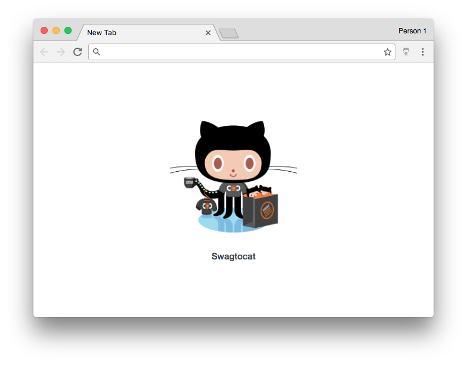

## Octotab
:octocat: Get a surprise Octocat in every new tab.

<p align="center"></p>

### Installation
1. Clone this repo
2. `npm install`
3. `npm run build`
4. Go to chrome://extensions
5. Click Load Unpacked Extension...
6. Choose the the directory you cloned Octotab to
7. Open a new tab :thumbsup:

### Updating
```
$ npm install
$ npm run build
```
